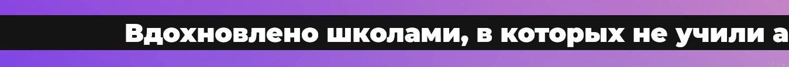

<h1 align="center"><a  href="https://algososh-rainbowpieeee.vercel.app/" target="_blank"></a></h1>

## Краткое описание проекта:

<p align="Left"> Визуализатор работы алгоритмов и структур данных, наглядно демонстрирует этапы их работы. Представлены следующие алгоритмы и структуры данных:

- алгоритм разворота строки
- алгоритм построения последовательности Фибоначчи
- алгоритм сортировки выбором, алгоритм сортировки "пузырьком" по возрастанию или убыванию
- работа структуры данных "стек"
- работа структуры данных "очередь"
- работа структуры данных "однонаправленный связный список"

[Открыть в браузере](https://algososh-rainbowpieeee.vercel.app/)

## Технологии, использованные при создании:

- React.js (CRA)
- TypeScript
- ES6 Classes

## Языки:

- HTML
- CSS
- TypeScript
- JSX

## Внешние компоненты

Для работы с проектом вам понадобятся git, NodeJS

- [Как установить git.](https://git-scm.com/book/en/v2/Getting-Started-Installing-Git)
- [Как установить NodeJS.](https://nodejs.org/en/download/package-manager/)

## Локальная установка:

В командной строке перейдите в папку, где будет развернут проект. После чего скопируйте его с GitHub:

```sh
`$ git clone git@github.com:rainbowpieeee/algososh.git`
```

Далее переходим в папку с проектом и устанавливаем компоненты:

```sh
`$ npm install`
```

Далее можно запускать проект на локальном сервере:

```sh
`$ npm start`
```

## Ссылки:

- [Макет](https://www.figma.com/file/RIkypcTQN5d37g7RRTFid0/Algososh_external_link)

- [Ссылка на деплой](https://algososh-rainbowpieeee.vercel.app/)

- [По вопросам доработки сайта](https://t.me/rainbow_pieeee)

## Проектная работа: "АЛГОСОШ". Создана в рамках учебы в [Яндекс.Практикум](https://praktikum.yandex.ru/) на курсе ["Веб-разработчик плюс"](https://practicum.yandex.ru/web-plus/).

<a  href="https://algososh-rainbowpieeee.vercel.app/" target="_blank"></a>